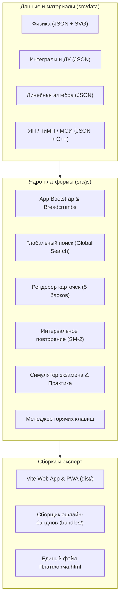

# 🎓 Bauman Study — Интерактивная платформа подготовки к экзаменам

<div align="center">

[](https://github.com/Shamanalle/bauman-study/actions/workflows/ci.yml)
[](https://github.com/Shamanalle/bauman-study/actions/workflows/deploy-pages.yml)
[](https://github.com/Shamanalle/bauman-study/releases)
[](https://katex.org/)
[](#-pwa-и-автономный-режим)

**Комплексная интерактивная образовательная среда для студентов МГТУ им. Н.Э. Баумана**  
Справочники, интервальные повторения (SM-2), генератор контрольных мероприятий, шпаргалки и лабораторные работы.

[🌐 **Открыть веб-версию платформы**](https://shamanalle.github.io/bauman-study/) • [📦 **Скачать офлайн-версию (ZIP)**](https://github.com/Shamanalle/bauman-study/releases/latest)

</div>

---

## ✨ Ключевые возможности

### 📚 Интерактивные теоретические карточки
- **5-блочная структура материала:** Строгое определение → Выделенная формула → Интуиция «простыми словами» → Советы для ответа экзаменатору → Пошаговое доказательство.
- **Математический рендеринг KaTeX:** Высокоскоростное отображение интегралов, матриц, систем дифференциальных уравнений и векторных полей.
- **Интерактивные векторные SVG-схемы:** Графики функций, физические диаграммы и архитектурные схемы с автоматической адаптацией под цветовую тему.

### 🃏 Умное повторение (Spaced Repetition)
- Встроенный движок интервального повторения на базе алгоритма **SuperMemo-2 (SM-2)**.
- Адаптивный расчет коэффициента легкости (Ease Factor), интервалов повторения и очереди карточек для долговременного запоминания формул и теорем.

### 🏋️ Практический режим и симулятор контрольных работ
- **Банк типовых задач и методов решения** по дифференциальным уравнениям, физике и линейной алгебре.
- **Симулятор контрольной / экзамена:** генерация билета со случайным или фиксированным набором задач, таймер с предупреждением о лимите времени и пошаговая самопроверка с разбором решения.

### ⌨️ Горячие клавиши и UX-навигация
- Быстрый поиск в один клик: клавиша `/` или `Ctrl + K`.
- Навигация по вопросам: `J` / `K` или `↓` / `↑`.
- Случайный вопрос для самопроверки: `R`.
- Переключение темы оформления (светлая/тёмная): `T`.
- Интерактивное окно подсказок по нажатию `?`.
- Sticky Breadcrumbs (`← Все предметы`) для бесшовного перемещения по разделам.

### 📱 PWA и автономный режим
- **Progressive Web App:** возможность установки на телефон (iOS, Android) или рабочий стол как нативное приложение.
- **Zero-Network Standalone HTML:** скрипты сборки компилируют любой раздел или всю платформу целиком в автономный однофайловый HTML (`Платформа.html`), работающий без интернета и локального веб-сервера.

---

## 🏛 Предметы и учебные модули

| Предмет | Теоретические билеты | Практический тренажёр | Учебное пособие | Лабораторные работы |
|:---|:---:|:---:|:---:|:---:|
| **Физика** | Экзамен, РК-1, РК-2 | РК-1, РК-2, Экзамен | 14 глав | — |
| **Интегралы и ДУ** | Экзамен, РК-1, РК-2, КР-1, КР-2 | РК-1, РК-2, КР-1, КР-2, Экзамен | 12 глав | — |
| **Линейная алгебра и ФНП** | РК-1, РК-2, КР-1 | РК-1, РК-2, КР-1, Экзамен | 16 глав | — |
| **Языки программирования (C++)** | Экзамен | Экзаменационная практика | 10 глав | 8 лаб (с разбором вариантов) |
| **Технологии программирования (ТиМП)** | — | — | 10 глав | 7 лаб × 25 вариантов |
| **Методы оптимизации и информатика (МОИ)** | Зачёт, КР-1, КР-2, КР-3 | КР-1, КР-2, КР-3 | 7 глав | — |

---

## 🚀 Архитектура системы



---

## 💻 Быстрый старт для разработчиков

### Требования
- **Node.js** >= 18.0.0
- **npm** >= 9.0.0

### Установка

```bash
# Клонировать репозиторий
git clone https://github.com/Shamanalle/bauman-study.git
cd bauman-study

# Установить зависимости
npm install

# Запустить локальный сервер для разработки
npm run dev
```

Приложение будет доступно по адресу `http://localhost:5173`.

### Доступные скрипты

| Команда | Описание |
|---|---|
| `npm run dev` | Запуск локального Vite сервера с поддержкой HMR |
| `npm run build` | Компиляция оптимизированной веб-версии в директорию `dist/` |
| `npm run preview` | Локальный просмотр продакшен-сборки |
| `npm run validate:practice` | Автоматическая верификация целостности всех 17 практических бандлов |
| `npm run bundle` | Генерация 28 автономных офлайн HTML-бандлов в директорию `bundles/` |
| `npm run build:platform` | Сборка единого автономного файла `Платформа.html` (1700+ вопросов, 0 зависимостей) |

---

## ⌨️ Управление с клавиатуры

| Клавиша | Действие |
|:---:|---|
| <kbd>/</kbd> или <kbd>Ctrl</kbd> + <kbd>K</kbd> | Активировать поиск по материалам |
| <kbd>J</kbd> / <kbd>K</kbd> или <kbd>↓</kbd> / <kbd>↑</kbd> | Переход к следующей / предыдущей карточке |
| <kbd>R</kbd> | Открыть случайный вопрос |
| <kbd>T</kbd> | Переключить тему оформления (светлая / тёмная) |
| <kbd>?</kbd> | Открыть интерактивное модальное окно помощи |
| <kbd>Esc</kbd> | Закрыть модальное окно или сбросить поисковый фильтр |

---

## 📄 Шпаргалки и печать (Cheat Sheets)

Платформа содержит встроенные оптимизированные шпаргалки по всем предметам. Для отправки на печать или сохранения в PDF откройте шпаргалку и нажмите `Ctrl + P` (или используйте системную печать браузера). Стили `@media print` автоматически:
- Скрывают элементы интерфейса, меню, поиск и плавающие кнопки.
- Оптимизируют размер шрифта KaTeX и убирают тени.
- Предотвращают разрыв карточек и формул между страницами (`break-inside: avoid`).
